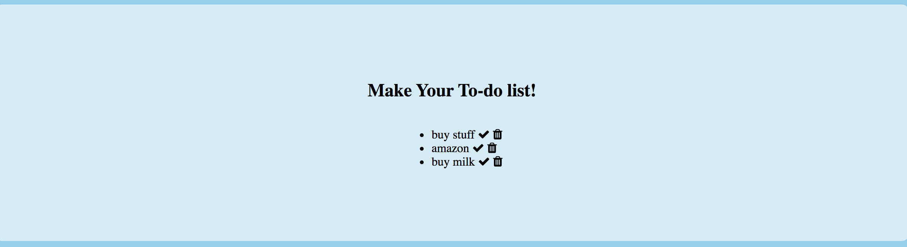

# ToDoExpress

How It's Made:
HTML, CSS, Javascript, EJS, node.JS MongoDB

About:
To do list! Write all of your tasks and cross them off your todo list!

Lesson Learned:
how to connect to an external server
the use of the Express package within the npm
debugging
creating and modifying Embedded Javascript Templates

Installation
Clone repo
run npm install
Usage
run ./folderDir/ node server.js
Navigate to localhost:3000
